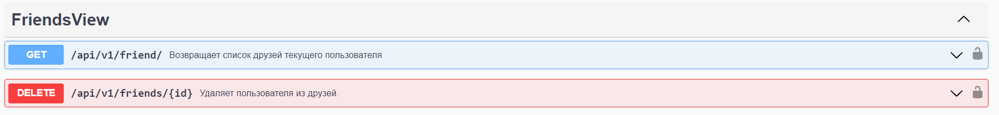

# Описание работы
## Спецификация OpenAPI
Спецификацию OpenAPI можно получить по запросу `api/schema/` или в директории `friends/extra_files/openapi_schema`

## Устройство приложения
- Модель данных основана на трёх таблицах: пользователя (User), списка заявок в друзья (InviteList) и списка друзей (FriendList)


# Доступные ручки API
*Disclaimer*: здесь и далее запросы будут описываться в виде: 

`<HTTP глагол> <адрес эндпоинта>`

Таким образом, записи 

`GET api/v1/api/v1/friends/` 

может соответствовать GET-запрос по адресу 

`http://127.0.0.1:8000/api/v1/friends/` 

с токеном для авторизации в заголовке.

Эти детали опущены для простоты восприятия документации.

## Ручки отправки заявки в друзья (InvitesView)

### Посмотреть входящие/исходящие заявки.
Чтобы посмотреть входящие заявки, достаточно отправить запрос

`GET api/v1/invites/` или `GET api/v1/invites/?is_in=true`.

Чтобы получить исходящие, используйте `GET api/v1/invites/?is_in=false`
### Принять/отклонить заявку.
Чтобы принять или отклонить заявку, используйте запрос

`POST api/v1/invites/<int:pk>/`, передавая тело запроса типа JSON
```json
{
  "action": "accept"
}
```
или
```json
{
  "action": "deny"
}
```
## Ручки взаимодействия с друзьями (FriendsView)

## Регистрация и авторизация
Зарегистрировать пользователя можно POST-запросом в `api/v1/auth/users/`

Авторизация происходить по токену в эндпоинте `auth`

# Описание и примеры вызова API
## Запуск сервиса
Для запуска сервиса используйте файл `docker-compose.yaml`. Он автоматически соберёт контейнер с сервисом и базой данных PostgreSQL.

Сервис будет развёрнут на порту 8000 локального сервера.

## Регистрация пользователя
Запрос: `POST http://127.0.0.1:8000/api/v1/auth/users/`

с телом
```json
{
  "email": "user@example.com",
  "username": "user4",
  "password": "adminadmin"
}
```
Приводит к созданию нового пользователя, о чём уведомляет ответом:
```json
{
    "email": "user@example.com",
    "username": "user4",
    "id": 4
}
```
## Отправить заявку в друзья
Отправьте `POST api/v1/invite/<int:pk>/`.

Если уже существует ответная заявка, пользователь будет добавлен в друзья автоматически.

Например:
был запрос дружбы от пользователя user2 пользователю user1.
user1 отправляет запрос `POST api/v1/invite/2/`

В ответ приходит:
```json
{
  "info": "Friend user2 added"
}
```
## Принять/отклонить заявку в друзья
Чтобы принять или отклонить заявку, используйте запрос

`POST api/v1/invites/<int:pk>/`, передавая id пользователя в качестве `pk` и тело запроса типа JSON
```json
{
  "action": "accept"
}
```
или
```json
{
  "action": "deny"
}
```
Например, user2 принял заявку user1 POST-запросом `api/v1/invites/1/`
с телом 
```json
{
  "action": "accept"
}
```
Ответ приложения:
```json
{
  "info": "Added user1 to your friend list."
}
```

## Посмотреть список входящих/исходящих заявок в друзья
Чтобы посмотреть входящие заявки, достаточно отправить запрос

`GET api/v1/invites/` или `GET api/v1/invites/?is_in=true`.

Чтобы получить исходящие, используйте `GET api/v1/invites/?is_in=false`

Например:
пусть user2 отправил заявку пользователю user3, а user3 - пользователю user1

Теперь user3 на запрос `GET api/v1/invites/?is_in=true` получит
```json
{
  "invites_in": [
    {
      "sender": 2,
      "getter": 3
    }
  ]
}
```
А на запрос `GET api/v1/invites/?is_in=false`:
```json
{
  "invites_out": [
    {
      "sender": 3,
      "getter": 1
    }
  ]
}
```
## Посмотреть список своих друзей
Решается запросом `GET api/v1/friends/`

Если у user1 в друзьях user2 и user3, то возвращаемое значение может выглядеть так:
```json
{
  "friends": [
    {
      "user1": 2,
      "user2": 1
    },
    {
      "user1": 1,
      "user2": 3
    }
  ]
}
```

## Получить статус дружбы с пользователем
Запрос: `GET api/v1/invites/<int:pk>/`

Ответ приходит в виде:
```json
{
  "friend_status": "<status>"
}
```
где `<status>` может быть:
- `friend` - друзья
- `outcoming invitation` - есть исходящая заявка
- `incoming invitation` - есть входящая заявка
- `none` - ни один из предыдущих случаев

Например, если user1 и user2 друзья, то запрос пользователя user1 `GET api/v1/invites/2/` вернёт:
```json
{
  "friend_status": "friend"
}
```

## Удалить пользователя из друзей
Этот крайне грустный запрос можно выполнить так: `DELETE api/v1/friends/<int:pk>/`

Пример: пусть user1 и user2 были друзьями и user1 отправил запрос удаления:

`DELETE api/v1/friends/2`

Результатом будет удаление user2 из друзей user1 (и наоборот) и следующее тело ответа:
```json
{
  "info": "User user2 removed from your friends."
}
```

*P.S. - спасибо всем сильным котятам, дочитавшим это до конца и пережившим мой код <3*